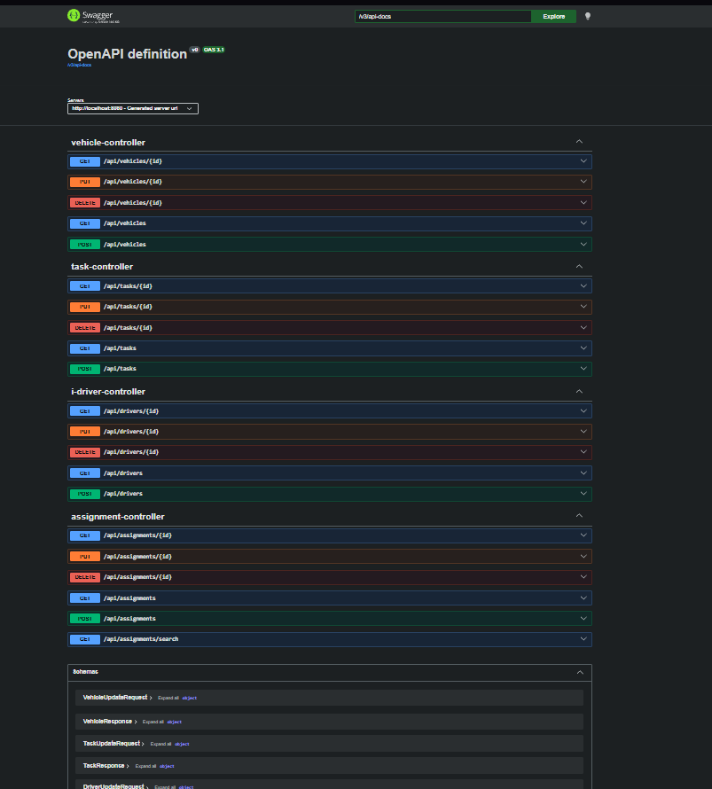

# Operasyon Çakışma Kontrol Servisi

Sürücü, araç ve görev atamalarını yöneten REST API. Aynı sürücü veya aracın çakışan saatlerde birden fazla göreve atanmasını engeller.

## Swagger UI



## Teknolojiler

- Java 21
- Spring Boot 4.1.1
- PostgreSQL
- Spring Data JPA
- Flyway (veritabanı migration yönetimi)
- MapStruct (DTO ↔ Entity dönüşümü)
- Bean Validation
- OpenAPI / Swagger UI
- Docker Compose
- Lombok

## Mimari

Katmanlı mimari kullanılmıştır:

```
Controller → Service → Repository → Entity
                ↕
              DTO ↔ Mapper
```

Her katman için Interface + Implementation pattern uygulanmıştır (`IDriverService` / `DriverServiceImpl` gibi).

## Özellikler

- Sürücü, araç ve görev CRUD işlemleri
- Göreve sürücü ve araç atama
- **Sürücü ve araç çakışma kontrolü** (aynı zaman aralığında birden fazla atama engellenir)
- Geçersiz zaman aralığı validasyonu
- Atamalarda tarih, sürücü ve araca göre filtreleme
- Pagination ve sorting
- Merkezi hata yönetimi (`@ControllerAdvice` ile)
- Swagger/OpenAPI dokümantasyonu

## Kurulum

### Gereksinimler

- Java 21
- Docker & Docker Compose
- Maven

### Adımlar

1. Veritabanını ayağa kaldırın:

```bash
docker compose up -d
```

2. Uygulamayı çalıştırın:

```bash
./mvnw spring-boot:run
```

3. Swagger UI'a erişin:

```
http://localhost:8080/swagger-ui/index.html
```

## Örnek Endpoint'ler

```
POST   /api/drivers
POST   /api/vehicles
POST   /api/tasks
POST   /api/assignments

GET    /api/assignments
GET    /api/assignments/{id}
GET    /api/assignments/search?serviceDate=...&driverId=...&page=0&size=20

PUT    /api/assignments/{id}
DELETE /api/assignments/{id}
```

## Çakışma Kontrolü Örneği

Aynı sürücü, çakışan saatlerde tekrar atanmaya çalışıldığında:

```json
{
  "code": "ASSIGNMENT_CONFLICT",
  "message": "Sürücü zaten 09:00 - 12:00 arasında atanmış.",
  "conflictingAssignmentId": 5
}
```

## Test Durumu

Tüm endpoint'ler Postman ve Swagger UI üzerinden manuel olarak test edilmiştir. JUnit 5 ve Testcontainers ile otomatik testler eklenecektir.
